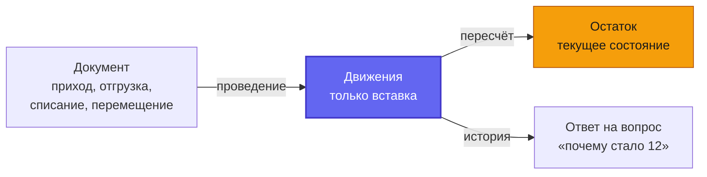
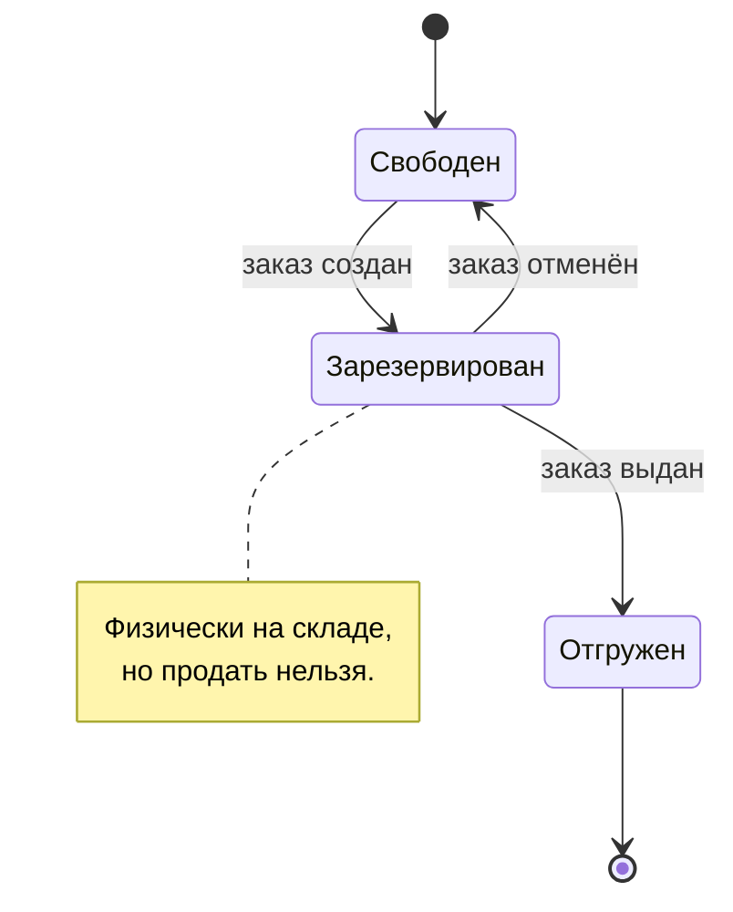

<div align="center">

# 📦 Складской учёт

**Документы · движения · остатки · себестоимость** — как считать, чтобы им верили

[](https://mysql.com)


</div>

---

## 💥 Наивная схема и момент, когда она разваливается

Первое, что приходит в голову: поле `quantity` в карточке товара, которое
увеличивается при приходе и уменьшается при продаже.

Работает ровно до первого вопроса владельца: **«почему вчера было 40, а сегодня
12?»** Ответить нечем — прошлого значения не существует, оно затёрто.

Дальше выясняется, что есть ещё вопросы, на которые такая схема не отвечает:

- сколько товара зарезервировано под неотгруженные заказы;
- по какой цене лежит то, что на складе сейчас;
- кто и когда провёл списание на 28 единиц;
- откуда взялось расхождение с инвентаризацией.

---

## 🏗️ Рабочая схема: три уровня вместо одного числа



**Документ** — намерение. Его составляют, редактируют, он может остаться
черновиком навсегда и на остаток при этом не влияет.

**Движение** — факт. Неизменяемая запись: что, где, сколько, когда, по какой цене,
из какого документа. Только вставка: ни `UPDATE`, ни `DELETE`.

**Остаток** — производная от движений, материализованная для скорости.

Ключевые поля движения:

```
movement_type      тип операции
quantity_delta     изменение со знаком
quantity_before    остаток до операции
quantity_after     остаток после
unit_cost          цена единицы в этой операции
occurred_at        когда произошло
```

`quantity_before` и `quantity_after` дублируют то, что можно посчитать
суммированием. Дублирование сознательное: оно превращает отладку расхождения из
раскопок в чтение одной строки.

---

## ⚡ Почему остаток хранится отдельно, хотя это денормализация

Формально `qty_on_hand` избыточен — его можно получить суммой движений. На
практике суммировать сотни тысяч строк на каждый показ карточки товара нельзя.

Поэтому остаток — кэш, и к нему прилагаются обязательства:

1. **Движение и пересчёт остатка — в одной транзакции.** Иначе при сбое между ними
   история и остаток разойдутся, причём тихо: ошибки нет, цифры неверные.
2. **Регулярная сверка.** Раз в сутки сумма движений сравнивается с остатком.
   Расхождение — инцидент, а не «ну бывает».
3. **Пересчёт из движений возможен в любой момент.** Раз остаток производный, его
   всегда можно восстановить. Это страховка, ради которой всё и затевалось.

---

## 🔖 Резерв — отдельное число

```
qty_on_hand    физически на складе
qty_reserved   отложено под заказы
доступно       qty_on_hand - qty_reserved
```

Товар под неотгруженный заказ лежит на складе, но продавать его второй раз нельзя.
Одно число `quantity` этого различия не выражает, и получается перепродажа: два
покупателя оплатили одну единицу.



---

## 🧾 Статус документа: черновик и проведённый

`draft → posted` — не украшение интерфейса, а граница ответственности.

- **Черновик** редактируется свободно, движений не создаёт, на остаток не влияет.
- **Проведение** — единственная операция, порождающая движения. После него
  документ неизменяем.
- Исправление проведённого документа — **не редактирование**, а сторнирующий
  документ. История не переписывается.

Это правило избавляет от целого класса проблем, где кто-то «поправил вчерашний
приход» и месячный отчёт изменился задним числом.

---

## 💰 Себестоимость: почему средняя, а не FIFO

`avg_cost` в остатке — средневзвешенная себестоимость, пересчитываемая при каждом
приходе:

```
новая_средняя = (остаток × старая_средняя + приход × цена_прихода)
                / (остаток + приход)
```

FIFO точнее и в рознице обычно избыточен: он требует хранить партии, отслеживать
их расход и усложняет каждый отчёт. Средневзвешенная даёт достаточную точность при
кратно меньшей сложности.

Решение зависит от бизнеса: там, где партии имеют сроки годности или различаются
по качеству, выбор обратный. Важно принять его осознанно и записать, а не получить
случайно.

---

## 📋 Инвентаризация: расхождение — это тоже документ

Пересчёт на складе почти всегда даёт расхождение с системой. Правильный способ его
внести — не поправить остаток руками, а создать документ инвентаризации, который
породит корректирующие движения.

Иначе теряется самое ценное: **сколько и почему разошлось**. А это и есть тот
отчёт, ради которого владелец затевал учёт.

---

## 🏢 Мультиарендность: закладывается сразу или никогда

`organization_id` в каждой таблице и составная уникальность:

```sql
UNIQUE (organization_id, document_no)   -- правильно
UNIQUE (document_no)                    -- система на одного клиента навсегда
```

Разница в момент проектирования — ноль. Разница при добавлении потом — переписать
каждую таблицу, каждый запрос и каждую проверку прав.

---

## ✅ Чек-лист проектирования складского учёта

- [ ] Движения неизменяемы, только вставка
- [ ] В движении есть остаток до и после
- [ ] Остаток хранится отдельно и пересчитывается в одной транзакции с движением
- [ ] Есть суточная сверка «сумма движений против остатка»
- [ ] Резерв отделён от физического наличия
- [ ] Документ имеет статус, движения порождает только проведение
- [ ] Исправление проведённого — сторно, а не правка
- [ ] Способ расчёта себестоимости выбран осознанно и записан
- [ ] Инвентаризация вносится документом, а не правкой остатка
- [ ] `organization_id` есть везде, уникальность составная

---

## 🔗 Смежные заметки

- [db-schema-notes](https://github.com/Shohruh1997/db-schema-notes) — ER-диаграммы этих таблиц
- [php-layered-architecture-notes](https://github.com/Shohruh1997/php-layered-architecture-notes) — где живёт сценарий проведения
- [uz-fiscal-compliance-notes](https://github.com/Shohruh1997/uz-fiscal-compliance-notes) — ИКПУ и маркировка в карточке товара

---

<div align="center">

**Шохрух Рузиев** · backend-разработчик, Ташкент

[](https://ecomdev.uz)
[](https://t.me/EcomDev_uz)

Исходный код систем — в приватных репозиториях, доступ по запросу.

</div>
